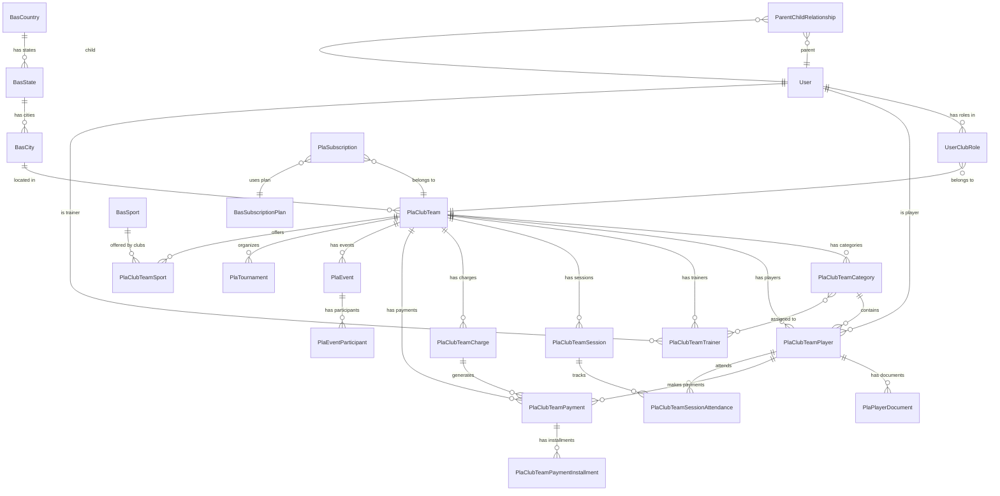

# Widdo Database Schema

## Overview

- **Total Tables:** ~80
- **Naming Convention:** `pla_*` (platform), `bas_*` (reference)
- **Multi-tenancy:** Via `club_id` with global scopes

---

## Entity Relationship Diagram (Main Entities)



---

## Critical Tables

### 1. `users`
Core user identity and authentication.

| Column | Type | Description |
|--------|------|-------------|
| id | bigint | Primary key |
| name | varchar | First name |
| lastname | varchar | Last name |
| email | varchar | Unique email |
| password | varchar | Hashed password |
| document_type_id | int | FK to `bas_types_documents_by_country` |
| document_number | varchar | ID document |
| birthdate | date | Date of birth |
| gender_id | int | FK to `bas_genders` |
| phone | varchar | Contact phone |
| profile_photo_path | varchar | Path to photo |
| status | varchar | ACT/INA/DEL |
| current_club_id | bigint | Active club context |
| email_verified_at | timestamp | Verification time |

### 2. `user_club_roles`
Multi-context role assignment (one user, multiple clubs/roles).

| Column | Type | Description |
|--------|------|-------------|
| id | bigint | Primary key |
| user_id | bigint | FK to users |
| club_id | bigint | FK to pla_club_teams |
| role | varchar | owner/trainer/player/parent/accountant |
| status | varchar | ACT/INA |
| onboarding_completed | boolean | Onboarding status |
| onboarding_step | int | Current step |
| metadata | json | Additional data |

**Unique constraint:** `(user_id, club_id, role)`

### 3. `pla_club_teams`
Main club/organization entity.

| Column | Type | Description |
|--------|------|-------------|
| id | bigint | Primary key |
| name | varchar | Club name |
| description | text | About the club |
| user_id | bigint | Owner user ID |
| city_id | bigint | FK to bas_cities |
| address | varchar | Physical address |
| telephone | varchar | Main phone |
| email | varchar | Contact email |
| profile_img | varchar | Logo path |
| public_enrollment_token | varchar | Public registration link |
| status | varchar | ACT/INA/DEL |

### 4. `pla_club_teams_players`
Player profiles linked to clubs.

| Column | Type | Description |
|--------|------|-------------|
| id | bigint | Primary key |
| club_id | bigint | FK to pla_club_teams |
| user_id | bigint | FK to users |
| category_id | bigint | FK to categories |
| position_id | bigint | FK to positions |
| jersey_number | int | Shirt number |
| is_starter | boolean | Starting player |
| status | varchar | ACT/INA/PEN |
| enrollment_date | date | Join date |

### 5. `pla_club_teams_payments`
Payment records.

| Column | Type | Description |
|--------|------|-------------|
| id | bigint | Primary key |
| club_id | bigint | FK to pla_club_teams |
| player_id | bigint | FK to players |
| charge_id | bigint | FK to charges |
| amount | decimal | Total amount |
| paid_amount | decimal | Amount paid |
| balance | decimal | Remaining |
| status | varchar | PEN/PAR/COM/CXL/OVD |
| due_date | date | Payment deadline |
| discount_id | bigint | Applied discount |

### 6. `pla_events`
Calendar events.

| Column | Type | Description |
|--------|------|-------------|
| id | bigint | Primary key |
| club_id | bigint | FK to pla_club_teams |
| created_by | bigint | Creator user ID |
| title | varchar | Event name |
| description | text | Details |
| type | varchar | training/match/meeting/etc |
| start_datetime | datetime | Start time |
| end_datetime | datetime | End time |
| location_id | bigint | FK to locations |
| status | varchar | scheduled/cancelled/completed |
| visibility | varchar | public/members/private |
| image_path | varchar | Event flyer |
| video_url | varchar | YouTube/Vimeo link |

### 7. `pla_subscriptions`
Club subscription status.

| Column | Type | Description |
|--------|------|-------------|
| id | bigint | Primary key |
| club_id | bigint | FK to pla_club_teams |
| plan_id | bigint | FK to bas_subscription_plans |
| status | varchar | active/trial/cancelled |
| billing_cycle | varchar | monthly/yearly |
| current_period_start | date | Billing start |
| current_period_end | date | Billing end |
| trial_ends_at | timestamp | Trial expiration |

---

## Tables with `club_id` (Multi-tenant)

These tables use `ClubScope` for automatic filtering:

- `pla_club_teams_categories`
- `pla_club_teams_charges`
- `pla_club_teams_discounts`
- `pla_club_teams_locations`
- `pla_club_teams_payments`
- `pla_club_teams_payments_installments`
- `pla_club_teams_players`
- `pla_club_teams_sessions`
- `pla_club_teams_sessions_attendances`
- `pla_club_teams_trainers`
- `pla_events`
- `pla_event_participants`
- `pla_player_documents`
- `pla_tournaments`

---

## Reference Tables (`bas_*`)

| Table | Description |
|-------|-------------|
| `bas_countries` | Countries with currency, timezone |
| `bas_states` | States/departments by country |
| `bas_cities` | Cities by state |
| `bas_genders` | Gender options |
| `bas_sports` | Available sports |
| `bas_positions` | Player positions by sport |
| `bas_types_documents_by_country` | ID document types |
| `bas_payment_methods` | Payment methods base |
| `bas_subscription_plans` | SaaS plan definitions |
| `bas_modules` | System modules for permissions |

---

## Key Indexes

```sql
-- Performance indexes added
CREATE INDEX players_club_deleted_idx ON pla_club_teams_players(club_id, deleted_at);
CREATE INDEX players_user_club_idx ON pla_club_teams_players(user_id, club_id);
CREATE INDEX payments_club_status_idx ON pla_club_teams_payments(club_id, status);
CREATE INDEX payments_due_status_idx ON pla_club_teams_payments(due_date, status);
CREATE INDEX sessions_club_date_idx ON pla_club_teams_sessions(club_id, session_date);
CREATE INDEX events_club_status_start_idx ON pla_events(club_id, status, start_datetime);
CREATE INDEX ucr_user_status_idx ON user_club_roles(user_id, status);
CREATE INDEX ucr_club_role_status_idx ON user_club_roles(club_id, role, status);
```

---

## Status Codes

### User/Player Status
- `ACT` - Active
- `INA` - Inactive
- `PEN` - Pending
- `DEL` - Deleted (soft delete)

### Payment Status
- `PEN` - Pending
- `PAR` - Partial payment
- `COM` - Completed
- `CXL` - Cancelled
- `OVD` - Overdue
